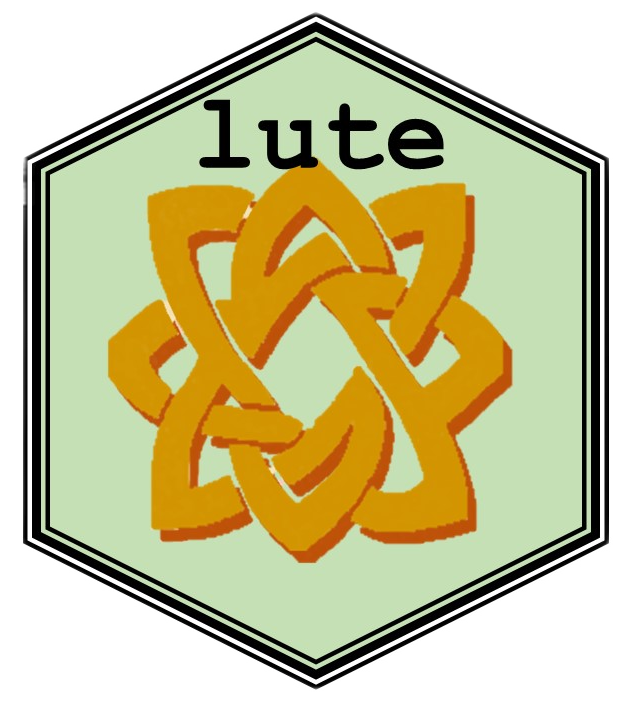

<!-- badges: start -->

[](https://github.com/metamaden/lute/actions)

<!-- badges: end -->


# lute

Authors: Sean Maden, Stephanie Hicks

[](https://github.com/metamaden/lute)

`lute` is a framework for deconvolution experiments.

## Installation

### From GitHub

Install `lute` from GitHub by running the following in an R session:

```
devtools::install("metamaden/lute")
```

## Framework overview

The `lute` R package supports bulk transcriptomics deconvolution experiments. It gets its name from the word "deconvolute," the problem of predicting cell amounts from cell mixtures. Users can use the `lute()` function to select for markers and perform deconvolution either with or without a cell size scale factor normalization (see `?lute` for details). For normalizations, data may be incorporated from the `cellScaleFactor` package and passed to the `s` argument for transformation of cell reference expression data prior to deconvolution.   

## Deconvolution methods supported

`lute` supports standard access to deconvolution algorithms with the `deconvolution()` generic function and affiliated class definitions. The below algorithms are currently supported or have bee tested using these specialized classes. They are listed with links to their main repos as well as conda YML scripts to install them with dependencies.

The following algorithms are included in the current build of `lute`:

* NNLS : The `nnlsParam` class supports the `nnls::nnls` implementation of the NNLS deconvolution algorithm ([url](https://cran.r-project.org/web/packages/nnls/index.html); [yml](https://github.com/metamaden/lute/blob/main/inst/yml/nnls.yml)).

* Bisque : The `bisqueParam` class supports the `BisqueRNA::ReferenceBasedDecomposition` implementation of the Bisque deconvolution algorithm ([url](https://github.com/cozygene/bisque); [yml](https://github.com/metamaden/lute/blob/main/inst/yml/bisque.yml)).

The following algorithms have been supported and tested using `lute`'s specialized classes, but they have not been included in the latest build.

* MuSiC : The `musicParam` class supports the `MuSiC::music.basic()` implementation of the MuSiC deconvolution algorithm ([url](https://github.com/xuranw/MuSiC); [yml](https://github.com/metamaden/lute/blob/main/inst/yml/music.yml)).

* MuSiC2 : The `music2Param` class supports both the `MuSiC::music2_prop()` and `MuSiC2::music2_prop()` implementations of the MuSiC2 deconvolution algorithm ([url](https://github.com/Jiaxin-Fan/MuSiC2); [yml](https://github.com/metamaden/lute/blob/main/inst/yml/music2.yml)).

* EPIC : The `epicParam` class supports the `EPIC::EPIC()` implementation of the EPIC deconvolution algorithm ([url](https://github.com/GfellerLab/EPIC); [yml](https://github.com/metamaden/lute/blob/main/inst/yml/epic.yml)).

* DeconRNASeq : The `deconrnaseqParam` class supports the `DeconRNASeq::DeconRNASeq()` implementation of the DeconRNASeq deconvolution algorithm ([url](https://bioconductor.org/packages/release/bioc/html/DeconRNASeq.html); [yml](https://github.com/metamaden/lute/blob/main/inst/yml/deconrnaseq.yml)).

* SCDC : The `scdcParam` class supports the `SCDC::SCDC_prop()` implementation of the SCDC deconvolution algorithm ([url](https://github.com/meichendong/SCDC); [yml](https://github.com/metamaden/lute/blob/main/inst/yml/scdc.yml)).

## Conda environments

To run specific deconvolution methods and algorithms, `lute` contains conda YML scripts. For example, set up an environement to run the MuSiC method with the following:

```
conda env create -f ./lute/inst/yml/music.yml
```

## Acknowledgements

We acknowledge the following individuals for their helpful feedback and suggestions on improving this project: Louise Huuki-Myers
