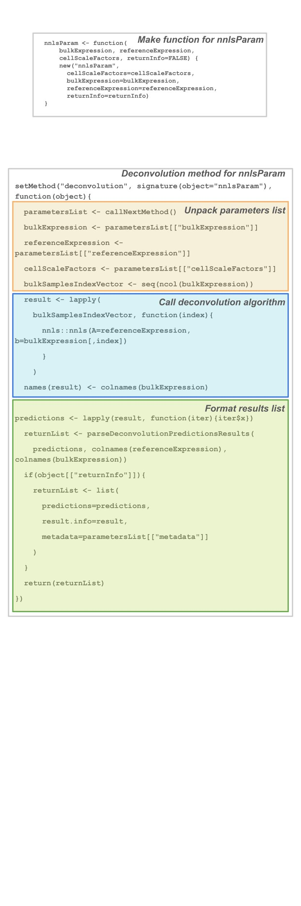
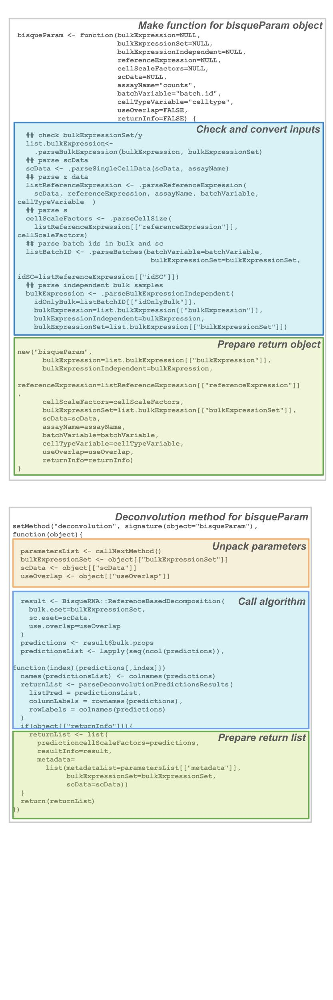

```{r setup, include=FALSE}
libv <- c("lute", "SummarizedExperiment", "SingleCellExperiment")
sapply(libv, library, character.only=TRUE)
knitr::opts_chunk$set(echo=FALSE, eval=TRUE)
```

# About

This guide describes `lute`'s generics, methods, and classes for algorithms, 
including deconvolution and marker selection algorithms. This software and the 
method to rescale on cell type-specific sizes is detailed in the manuscript
@maden_lute-preprint_2024. This may be useful to algorithm developers and 
researchers interested in conducting systematic algorithm benchmarks.

## Background 

The class structure used by `lute` is based on the [`bluster`](https://bioconductor.org/packages/release/bioc/html/bluster.html) R/Bioconductor 
package. It expands on that class structure by defining a hierarchy. 

## Motivation

Many algorithms are maintained and versioned in GitHub or Zenodo rather than a 
routinely versioned repository such as Bioconductor or CRAN. This can prove an 
obstacle when tracing package development and attempting comprehensive 
benchmarks, as software that is not actively maintained can become deprecated 
over time, and not all software will use compatible dependency versions 
(@maden_challenges_2023). 

`lute` classes can help to (1.) encourage use of common Bioconductor 
object classes (e.g. `SummarizedExperiment`, `SingleCellExperiment`, 
`DelayedArray`, etc.) and (2.) to use more standard inputs and outputs to 
encourage code reuse, discourage duplicated efforts, and enable more rapid and 
exhaustive benchmarks.

# Classes 

In a general sense, the class hierarchy is a wrapper allowing access to many 
algorithms using a single function and shared methods. However, it is possible 
to share data reformatting and preprocessing tasks, making the hierarchy more 
effectively similar to a workflow.

## typemarkerParam

Topmost parameter class for cell type gene markers. This is used to manage the 
marker IDs.

## deconvolutionParam

This is the parent class for all deconvolution algorithm param objects. The 
`deconvolutionParam` class is minimal, and simply defines slots for 
`bulkExpression`, or a matrix of bulk expression data, and `returnInfo`, 
a logical value indicating whether the default algorithm output will be stored
and returned with standard output from running the `deconvolution()` method on 
a valid algorithm param object.

### referencebasedParam

As shown in the class hierarchy diagram (above), `referencebasedParam` is a 
parent subclass inheriting attributes from `deconvolutionParam`. It is meant to
contain and manage all tasks shared by reference-based deconvolution algorithms,
or algorithms that utilize a cell type summary dataset. This is to be 
distinguished from reference-free algorithms. 

This param class adds slots for `referenceExpression`, the cell type reference 
data, and `cellScaleFactors`, an optional vector of cell type size factors used 
to transform the reference.

### independentbulkParam

This class is a subset of `referencebasedParam` algorithms specifying explicit 
samples used separately, such as for discrete training and test stages.

This param class adds a slot called `bulkExpressionIndependent`, which is for a 
dataset of bulk samples independent from samples specified in the 
`bulkExpression` slot.

## Helper functions

`lute` provides a number of helper functions used to make the algorithm classes 
work. These include the parent classes and subclasses, and several functions to 
convert between object classes. These helper functions may be useful to 
developers. The following table indicates the functions and a short summary of 
what they do.

```{r}
dfHelpers <- read.csv("helper_functions.csv") |> as.data.frame()
knitr::kable(dfHelpers, align = "c")
```

# Algorithms

## findMarkers

The param class `findmarkersParam` is defined for the function `findMarkers()` 
from `scran` (see `?findmarkersParam`). This is a function to identify cell type 
marker genes from a single-cell or single-nucleus expression dataset. 

The `findmarkersParam` class is organized under its parent classes as 
`typemarkersParam->findMarkersParam`. It includes the `typemarkers()` method for
the identification of marker genes, and `show()` for inspecting the param 
contents.

The following images annotate the constructor function and the `typemarkers()` 
generic defined for the `findmarkersParam` class.


## NNLS

The param class `nnlsParam` is defined for the function `nnls` from the `nnls` 
R/CRAN package (see `?nnlsParam`). Non-negative least squares (NNLS) is commonly 
used for deconvolution. 

The `nnlsParam` class is organized under its parent classes as 
`deconvolutionParam->referencebasedParam->nnlsParam`. It includes the 
`deconvolution()` generic for cell type deconvolution, and the `show()` method 
for inspecting the param contents.

The following images annotate the constructor function and the `deconvolution()` 
generic defined for the `nnlsParam` class.



## Bisque

The param class `bisqueParam` is defined for the function 
`ReferenceBasedDeconvolution` from the `BisqueRNA` R/Bioconductor package (see 
`?bisqueParam`). The Bisque algorithm adjusts on assay-specific biases arising 
between the bulk and single-cell or single-nucleus platforms used to generate 
expression datasets for deconvolution.

The `bisqueParam` class is organized under its parent classes as 
`deconvolutionParam->referencebasedParam->independentbulkParam->bisqueParam`. 
It includes the `deconvolution()` generic for cell type deconvolution, and the 
`show()` method for inspecting the param contents.

The following images annotate the constructor function and the `deconvolution()` 
generic defined for the `bisqueParam` class.



# Extensions

We demonstrated the extensibility and flexibility of `lute`'s generic, method, 
and class system by extending support for additional algorithms beyond the 3 
described above.

These algorithms can be used by sourcing the provided R/GitHub packages which
pair the classes and functions with YML files for easier dependency management.

## meanRatios

The param class `meanratiosParam` is defined for the function 
`get_mean_ratios2()` from the `DeconvoBuddies` R/GitHub package at [LieberInstitute/DeconvoBuddies](https://github.com/LieberInstitute/DeconvoBuddies). 
This function uses the mean of cell type summary ratios to rank and select for 
top marker genes.

The `meanratiosParam` class is organized under its parent classes as 
`typemarkersParam->meanratiosParam`. It includes the `typemarkers()` generic for
the identification of marker genes, and the `show()` method for inspecting the 
param contents.

`meanratiosParam` is available from GitHub at [metamaden/meanratiosParam](https://github.com/metamaden/meanratiosParam).

## DeconRNASeq

`deconvolutionParam->referencebasedParam->deconrnaseqParam`.

The param class `deconrnaseqParam` is defined for the function `DeconRNASeq` 
(see `?deconrnaseqParam`) from the `DeconRNASeq` R/Bioconductor package 
([link](https://bioconductor.org/packages/release/bioc/html/DeconRNASeq.html)). 
The DeconRNASeq algorithm uses weighted averaged expression between types to 
predicted cell type amounts more accurately for heterogeneous tissues 
(@gong_deconrnaseq_2013).

The `deconrnaseqParam` class is organized under its parent classes as 
`deconvolutionParam->referencebasedParam->deconrnaseqParam`. It includes the 
`deconvolution()` generic for cell type deconvolution, and the `show()` method 
for inspecting the param contents.

The `deconrnaseqParam` class is available from GitHub at 
[metamaden/deconrnaseqParam](https://github.com/metamaden/deconrnaseqParam)

## EPIC

The param class `epicParam` is defined for the function `EPIC` from the `EPIC` 
R/GitHub package (see `?epicParam`). The EPIC algorithm was developed in blood 
samples and incorporates cell size mRNA abundance (i.e. cell size) and variance 
normalizations (@racle_epic_2020).

The `epicParam` class is organized under its parent classes as 
`deconvolutionParam->referencebasedParam->epicParam`. It includes the 
`deconvolution()` generic for cell type deconvolution, and the `show()` method for inspecting the param contents.

The `epicParam` class is available from GitHub at 
[metamaden/epicParam](https://github.com/metamaden/epicParam)

## MuSiC

The param class `musicParam` is defined for the function 
`ReferenceBasedDeconvolution` from the `MuSiC` R/GitHub package (see 
`?musicParam`). The MuSiC algorithm adjusts on between-source variances for 
reference data from multiple sources (@wang_bulk_2019).

The `musicParam` class is organized under its parent classes as 
`deconvolutionParam->referencebasedParam->musicParam`. It includes the 
`deconvolution()` generic for cell type deconvolution, and the `show()` method 
for inspecting the param contents.

The `musicParam` class is available from GitHub at [metamaden/musicParam](https://github.com/metamaden/musicParam)

## MuSiC2

The param class `music2Param` is defined for 2 implementations of the `MuSiC2` 
algorithm from the `MuSiC` and `MuSiC2` R/GitHub packages, respectively (see 
`?music2Param`). The MuSiC2 algorithm pairs the features of the MuSiC algorithm 
with an additional filter for marker genes differentially expressed between 
cases and controls in the bulk and expression datasets (@fan_music2_2022).

The `music2Param` class is organized under its parent classes as 
`deconvolutionParam->referencebasedParam->independentbulkParam->music2Param`.
It includes the `deconvolution()` generic for cell type deconvolution, and the
`show()` method for inspecting param contents.

The `music2Param` class is available from GitHub at [metamaden/music2Param](https://github.com/metamaden/music2Param)

# Conclusions

This vignette showed how `lute`'s classes and methods are extensible and 
modular, and can encourage further development with standard algorithm I/O and 
object class management. First, we described `lute`'s algorithm class hierarchy, 
including how its parent classes and subclasses manage common tasks shared among 
algorithms and a table of functions developers may find useful. Further, we 
showed the annotated class and generic functions for algorithms supported by 
`lute` out of the box. Finally, we detail additional algorithms supported by 
R/GitHub packages that may be individually installed. 

# Session info

```{r}
sessionInfo()
```

# Works cited

