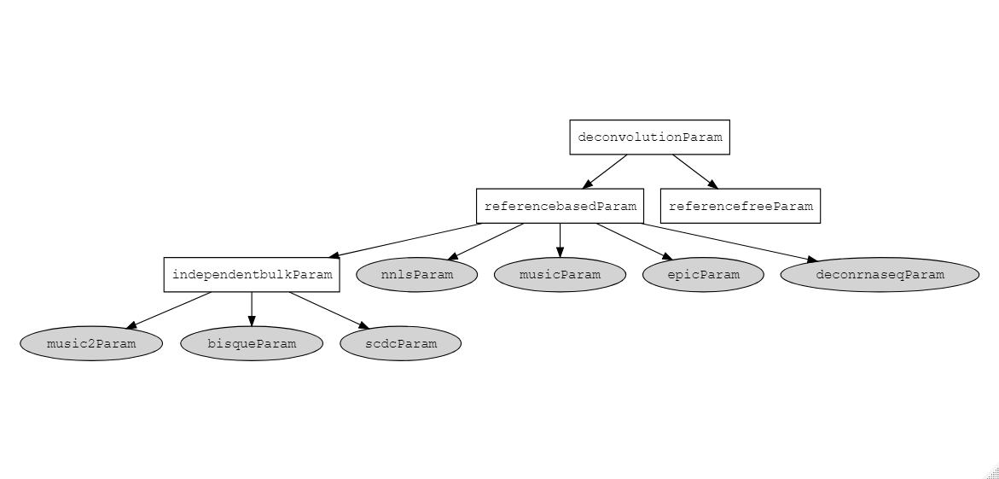

```{r setup, include=FALSE}
libv <- c("lute", "SummarizedExperiment", "SingleCellExperiment")
sapply(libv, library, character.only = TRUE)
knitr::opts_chunk$set(echo = TRUE, eval = TRUE)
```

# How to use this guide

This User's Guide describes how to use `lute`, a framework for bulk 
transcriptomics deconvolution. An introduction to deconvolution experiments is 
provided, followed by a description of the framework and a small experiment 
using example data.

Begin by passing the following to your active R session:

```{r}
library(lute)
```

# Deconvolution overview

## Definition

Deconvolution is the task of quantifying signal from a signal mixture, which
is sometimes called a signal convolution. Deconvolution experiments try to 
predict signals from their mixtures as accurately and reliably as possible. 

## Transcriptomics deconvolution

In the field of transcriptomics, deconvolution is often applied to gene 
expression datasets in order to predict cell type quantities from cell mixtures.
This technique is applied to bulk tissue specimens of multiple cell types, where
accurate cell type quantifications can improve bias adjustments or allow testing
of new hypotheses.

## Experiment elements

Most deconvolution algorithms predict the type-specific proportions from a 
signature matrix and a convoluted signals matrix in the following manner:

$$P \leftarrow [Y, Z]$$
Where we have the following term definitions for bulk transcriptomics deconvolution:

* $P$ : $K$-length vector of predicted proportions for the number of cell types $K$.

* $Z$ : Signature expression matrix, with dimensions of $G$ total rows of 
signature genes by $K$ total columns of cell types.

* $Y$ : The convoluted signals expression matrix, with dimensions of $G$ total 
rows of signature genes by $J$ total columns of bulk samples.

The above terms are shared by reference-based deconvolution algorithms, which
are defined by their requirement of a signature matrix $Z$ to make predictions.

Some additional important properties to consider are the preparation steps used
to generate the terms $Z$ and $Y$. These steps might include data rescaling and
transformation of the expression signals, or certain selection criteria to 
arrive at the final set of $G$ signature genes.

## Pseudobulking

Another important representation of deconvolution is in terms of a pseudobulk 
equation. A pseudobulk is a simulated bulk sample generated using either cell- 
or type-level reference data. Pseudobulk analysis is a common task for 
deconvolution experiments. 

We may represent the pseudobulked sample $Y_{PB}$ in terms of the $Z$ signature
matrix and $P$ cell type proportions, defined as above, as well as some 
$K$-length vector $S$, which contains cell size estimates used for rescaling 
$Z$. This looks like the following: 

$$Y_{PB} = Z * P * S$$

Inclusion of the $S$ vector of cell size scaling factors is an important 
strategy to correct for potential bias due to systematic differences in sizes 
between the sizes of predicted cell types. It has been used in deconvolution 
studies of a variety of tissues, including brain and blood 
(@monaco_rna-seq_2019, @racle_epic_2020, @sosina_strategies_2021).

## Deconvolution algorithms

There are dozens of different deconvolution algorithms used in the field of 
trascriptomics alone. These may be organized in several ways, such as whether 
they incorporate a variance weighting strategy or cell size scale factors. 
Another useful way to organize algorithms is by whether they incorporate the
non-negative least squares (NNLS) algorithm in some way. This is a statistical
approach with the added constraint of assumed non-negativity for inputs, which
holds when we consider typical gene expression datasets in the form of counts
or log-normalized counts.

The next section shows a hierarchical class structure for accessing multiple
deconvolution algorithms, and we can think of this hierarchy as yet another
way of organizing and relating different deconvolution algorithms in a useful
and actionable manner.

# The `lute` framework for deconvolution

`lute` supports deconvolution experiments by coupling convenient management of
standard experiment tasks with standard mappings of common inputs to their 
synonyms in supported algorithms for marker selection and deconvolution.

Accessing the framework is as simple as running the `lute()` function using 
your experiment data (see `?lute` for details). Runnable examples using the 
framework function are provided below.

## Supported deconvolution algorithms

To view a table of supported algorithms and their details, pass the following 
code to your R session:

```{r}
info.table <- lute_supported_deconvolution_algorithms()[,seq(5)]
knitr::kable(info.table)
```

## The `deconvolutionParam` class hierarchy

Briefly, `lute` defines a new class hierarchy that organizes deconvolution 
functions. This was based on the approach uesd by the `bluster` R/Bioconductor 
package for clustering algorithms.

Classes in this hierarchy each have a method defined for the `deconvolution()`
generic function (see `?deconvolution` for details). Methods for higher-level 
parent classes like `referencebasedParam` will perform data summary and marker 
genes comparisons. For the algorithm-specific classes, such as `nnlsParam` or 
`musicParam`, the method maps standard inputs like $Y$, $Z$, and $S$ to their 
algorithm-specific synonyms.

The `deconvolutionParam` class hierarchy for supported algorithms is visualized 
in the following diagram:



The `deconvolutionParam` class hierarchy is intended to be extensible to new 
algorithms. A future vignette will provide a step-by-step guide to supporting 
a new algorithms using these classes and their methods.

# Deconvolution experiment example

This section features several runnable examples of deconvolution experiments
using the `lute()` framework function.

We may begin with an object of type `SingleCellExperiment` (a.k.a. "sce" object) 
containing cell-level expression data. We may use the main `lute()` framework 
function to perform a deconvolution experiment with these data.

For demonstration, we generate a randomized sce object with `random_sce()` (see 
`?random_sce` for details). Set the $G$ marker genes to be 10, or 5 per cell 
type, which we will identify from an initial set of 100 genes:

```{r}
markers.per.type <- 5
total.genes <- 100
sce.example <- random_sce(num.genes = total.genes)
```

We could identify marker genes in `sce.example` now by running `lute` without
setting the deconvolution algorithm argument:

```{r, eval = F}
markers <- lute(sce = sce.example, 
                markers.per.type = markers.per.type, 
                deconvolution.algorithm = NULL)
length(markers$typemarker.results)
```

We identified 10 marker genes from the provided data.

To run a more complete experiment, we need to define $Y$. For this demonstration,
we define $Y$ as a pseudobulk from the provided `sce.example` data using 
`ypb_from_sce()` (see `?ypb_from_sce` for details).

```{r}
y <- ypb_from_sce(sce = sce.example, 
                  assay.name = "counts", 
                  celltype.variable = "celltype")
y <- as.matrix(y)
```

By default, the pseudobulk used all available cell data in `sce.example`. 

Finally, we run marker selection and deconvolution in succession with `lute` as
follows:

```{r}
experiment.results <- lute(sce = sce.example, y = y, typemarker.algorithm = NULL)
```

By default, `lute` used the mean ratios algorithm to get markers, then the 
NNLS algorithm to get cell type proportion predictions.

We can inspect the predicted cell type proportions $P$ from `experiment.results`:

```{r}
experiment.results$deconvolution.results
```

# Conclusions and further reading

This User's Guide introduced the `lute` framework for deconvolution, including 
an outline of deconvolution experiment variables, an introduction to the 
different deconvolution methods for bulk transcriptomics, and a small runnable
example showing how to access the NNLS algorithm by calling the `deconvolution`
generic on an object of class `nnlsParam`. If you found this guide useful, you 
may also find the other vignettes included in `lute` to be helpful.

# Works cited

